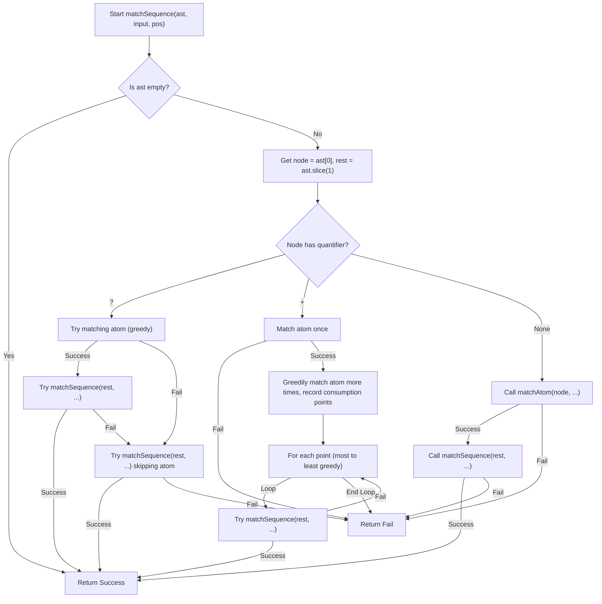

[](https://app.codecrafters.io/users/codecrafters-bot?r=2qF)

---

# Grep for JavaScript - A Technical Write-Up

This document provides a detailed technical explanation of a `grep`-like command-line utility built with Node.js. The tool is designed to search for text patterns within files or standard input, supporting a subset of regular expression syntax, including recursive directory searching.

The entire application is self-contained in a single script, which can be broken down into three primary components:

1.  **Main Execution Controller**: Handles command-line arguments, file I/O, and orchestrates the overall process.
2.  **Pattern Parser**: Transforms a regular expression string into an Abstract Syntax Tree (AST).
3.  **Backtracking Matcher**: Traverses the AST to determine if an input string matches the pattern.

## Features

- **Pattern Matching**: Implements a custom engine for a subset of ERE (Extended Regular Expression) syntax.
  - **`.`**: Matches any single character.
  - **`?`**: Matches the preceding atom zero or one time (optional).
  - **`+`**: Matches the preceding atom one or more times.
  - **`[...]`**: Matches any single character within the brackets (e.g., `[abc]`).
  - **`[^...]`**: Matches any single character _not_ within the brackets (e.g., `[^abc]`).
  - **`(...)`**: Groups a sequence of atoms.
  - **`|`**: Acts as an "OR" operator within a group (e.g., `(a|b)` matches `a` or `b`).
  - **`\d`**: Matches any digit.
  - **`\w`**: Matches any word character (alphanumeric + underscore).
- **Line Anchoring**:
  - **`^`**: Anchors the pattern to the beginning of the line.
  - **`$`**: Anchors the pattern to the end of the line.
- **Recursive Search**: The `-r` flag enables searching through directories and their subdirectories.
- **Standard Input**: Reads from `stdin` if no file or directory paths are provided.
- **Standard Exit Codes**:
  - Exits with code `0` if at least one match is found.
  - Exits with code `1` if no matches are found.

## Usage

The script is executed using Node.js from the command line.

```sh
# Basic usage on a single file
node your_program.js -E "pattern" file.txt

# Usage on multiple files
node your_program.js -E "pattern" file1.txt file2.txt

# Recursive search in a directory
node your_program.js -r -E "pattern" ./my_directory

# Reading from standard input
cat file.txt | node your_program.js -E "pattern"
```

## Architecture and Logic

The script operates in a sequence: initialize, parse the pattern, and then match against the input.

### I. Main Execution Flow

The `main()` function is the application's entry point. It controls the program's lifecycle from setup to exit.

1.  **Argument Parsing**: The script begins by parsing command-line arguments from `process.argv`. It checks for the `-r` (recursive) and `-E` (pattern) flags to determine the operational mode, the pattern to search for, and the list of file/directory paths.
2.  **Input Handling**:
    - If no file paths are provided, it assumes the input is piped from `stdin` and reads from `fs.readFileSync(0)`.
    - If paths are provided, it proceeds with file-based searching.
3.  **File Traversal**:
    - If the `-r` flag is present, the `collectFilesRecursively()` function is called for each path. This function uses `fs.statSync` to check if a path is a file or a directory. If it's a directory, it reads its contents with `fs.readdirSync` and calls itself on each entry, effectively traversing the entire directory tree. All discovered file paths are collected into an array.
    - If `-r` is not used, the paths are treated as a simple list of files.
4.  **Processing and Matching**: The script iterates through each file to be searched (or the lines from `stdin`). It reads the file content, splits it into an array of lines, and then iterates through each line, calling `isMatch()` to check for a pattern match.
5.  **Output Formatting**:
    - If a line matches, it is printed to `stdout`.
    - The filename is prepended to the output (`file:line`) if the search is recursive or involves multiple files, providing context for the match.
6.  **Exit Status**: A boolean flag `matched` tracks whether any match has occurred. The program concludes with `process.exit(matched ? 0 : 1)`, adhering to standard command-line tool conventions.

#### Flowchart: Main Execution


### II. The Pattern Parser

The `parse()` function is a **recursive descent parser**. Its sole purpose is to convert the flat regular expression string into a structured, hierarchical **Abstract Syntax Tree (AST)**. The AST is an array of nodes that is much easier for the matcher to execute.

- **AST Node Structure**: Each node in the AST is an object describing a piece of the pattern, for example:
  - `{ type: "char", char: "a", quant: null }`
  - `{ type: "escape", code: "d", quant: "+" }`
  - `{ type: "class", chars: "abc", negated: false, quant: "?" }`
  - `{ type: "group", options: [ [node1], [node2] ], quant: null }`
- **Parsing Process**: The parser consumes the pattern string character by character.
  - `parseSequence()`: The main parsing loop. It iterates through the pattern and delegates to other functions based on special characters.
  - `parseGroup()`: Triggered by `(`, it parses the content within a group, handling alternation (`|`) by creating separate branches in the `options` array.
  - `parseCharClass()`: Triggered by `[`, it parses the contents of a character class.
  - `parseQuantifier()`: Called after parsing an atom to check if `?` or `+` follows.

#### Flowchart: Parser (`parseSequence`)


### III. The Backtracking Matcher

The core of the pattern matching logic is a **recursive backtracking algorithm**. This algorithm finds a match by trying different possibilities; if one path leads to a dead end, it "backtracks" to the last decision point and tries a different option.

The matching logic is split across three functions: `isMatch`, `matchSequence`, and `matchAtom`.

1.  **`isMatch(line, ast, anchoredStart, anchoredEnd)`**: The high-level controller.

    - It handles anchoring. If `^` is present, it only attempts a match from the very beginning of the line.
    - For unanchored patterns, it loops through the input line, attempting to start a match from every possible character position (`line.slice(i)`). This simulates a "sliding window."
    - It also enforces the `$` anchor, ensuring that a successful match consumed the entire rest of the line.

2.  **`matchSequence(ast, input, pos)`**: The main recursive engine.

    - **Base Case**: If the `ast` array is empty, it means the entire pattern has been successfully matched, and it returns `true`.
    - **Recursive Step**: It takes the first `node` from the AST and the `restOfAST`.
      - **No Quantifier**: It calls `matchAtom` to match the single node. If successful, it makes a recursive call: `matchSequence(restOfAST, ...)`.
      - **`?` Quantifier**: It first _greedily_ tries to match the atom. If that leads to a full match of the `restOfAST`, it returns `true`. If not, it backtracks and tries to match the `restOfAST` again, this time _skipping_ the optional atom entirely.
      - **`+` Quantifier**: This is the most complex case of backtracking. It first greedily matches the atom as many times as possible, recording each position where a successful match ended (a "consumption point"). Then, it works backward from the most greedy match, trying to match the `restOfAST` from each consumption point until a full match is found.

3.  **`matchAtom(node, input, pos)`**: The base worker.
    - This function handles the logic for matching a _single, non-quantified_ AST node (a literal character, a class, an escape sequence, or a group) at the current `pos` in the input. For a group node, it iterates through its `options`, calling `matchSequence` on each one until a match is found.

#### Flowchart: Matcher (`matchSequence`)


